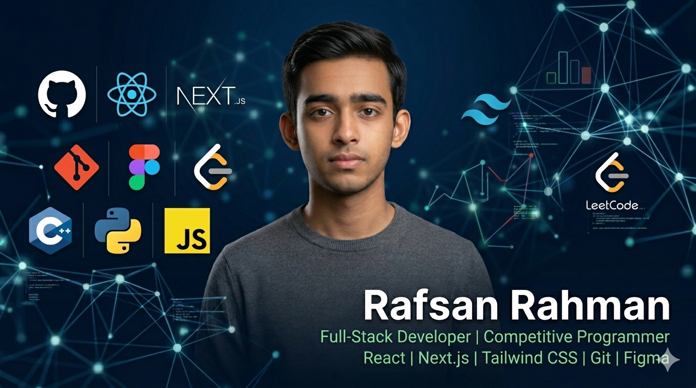

# Rafsan Rahman

**Full-Stack Developer · Competitive Programmer**

  

---

## About Me

I'm an aspiring full-stack developer with a passion for competitive programming. I love building practical tools and solving algorithmic challenges — always learning, always shipping.

- 🔭 Currently building **[Drive Fleet](https://github.com/raf0670/drive-fleet-client)** — a car-rental service platform
- 🌱 Deepening my knowledge in **React.js** and **Next.js**
- 💻 All my projects live at **[github.com/raf0670](https://github.com/raf0670/)**
- 📄 Check out my **[Resume](https://docs.google.com/document/d/1nXOYRXVYPx10Cxd-9DcG3DVwCHtV1f62/edit?usp=sharing&ouid=102503716529705387346&rtpof=true&sd=true)**
- 📬 Reach me at **rafsan0670@gmail.com**

---

## Tech Stack

**Languages**

**Frontend**

**Tools & Design**

**Currently Learning**

---

## Competitive Programming

---

## GitHub Stats

<!-- 

 -->

---

## Connect

---

  <i>"Code is like humor. When you have to explain it, it's bad." — Cory House</i>

